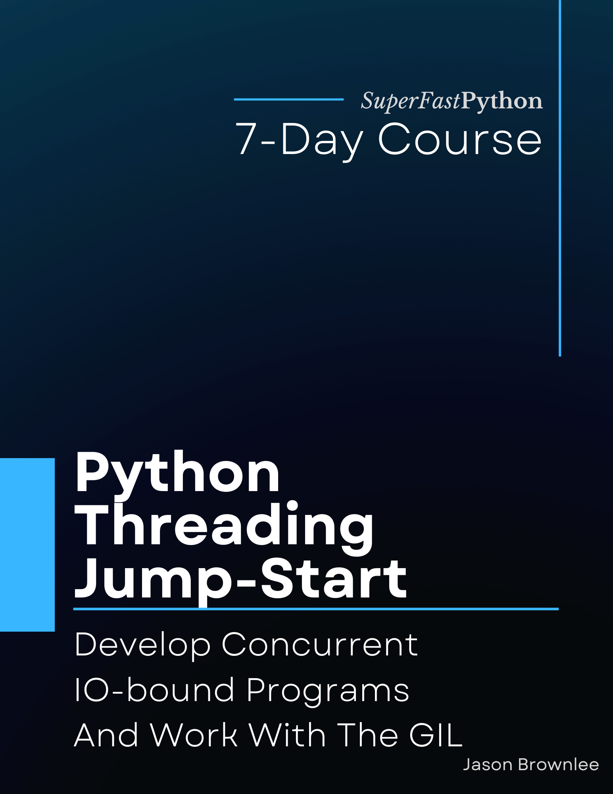

# Python Threading Jump-Start

* <https://github.com/SuperFastPython/PythonThreadingJumpStart>

This repository provides all source code for the book:

* **Python Threading Jump-Start**: _Develop Concurrent IO-bound Programs And Work With The GIL_, Jason Brownlee, 2022.

## Source Code
You can access all Python .py files directly here:

* [src/](src/)

### Book Blurb

> Unlock concurrency with Python threads (and run 100s or 1,000s of tasks simultaneously).
>
> The threading module provides easy-to-use thread-based concurrency in Python.
>
> Unlike Python multiprocessing, the threading module is limited by the infamous Global Interpreter Lock (GIL).
>
> Critically, the GIL is released when performing blocking I/O. Additionally, threads can share memory make them perfectly suited to I/O-bound tasks such as reading and writing from files and socket connections.
>
> This is the API you need to use to make your code run faster.
>
> Introducing: "Python Threading Jump-Start". A new book designed to teach you the threading module in Python, super fast!
>
> You will get a rapid-paced, 7-part course to get you started and make you awesome at using the threading API.
>
> Each of the 7 lessons was carefully designed to teach one critical aspect of the threading module, with explanations, code snippets and worked examples.
>
> You will discover:
>
> * How to choose tasks that are well suited to threads.
> * How to create and run new threads.
> * How to locate and query running threads.
> * How to use locks, semaphores, barriers and more.
> * How to share data between threads using queues.
> * How to execute ad hoc tasks with reusable worker threads.
> * How to gracefully stop and forcefully kill threads.
>
> Each lesson ends with an exercise for you to complete to confirm you understand the topic, a summary of what was learned, and links for further reading if you want to go deeper.
>
> Stop copy-pasting code from StackOverflow answers.
>
> Learn Python concurrency correctly, step-by-step.

